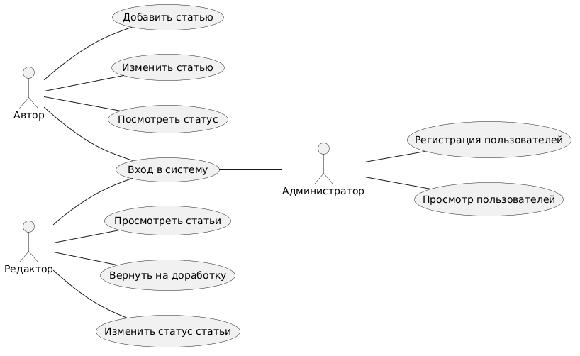

Информационная система предназначена для учета статей в журнале. В системе будет храниться информация о названии статьи, её авторе, рубрике, дате создания и текущем статусе

**Цели системы**: упрощение хранения и обработки информации о статьях. Система позволит добавлять статьи, изменять их, отправлять на проверку и отмечать опубликованные материалы

**Пользователи системы**: 

* Автор (добавляет новые статьи, изменяет их, просматривает статус проверки статьи)

* Редактор (просматривает статьи, возвращает их на доработку или одобряет публикацию)

* Администратор (регистрирует авторов и редакторов, просматривает список пользователей)

Основные функции:

1)	Вход в систему по логину и паролю
2)	Добавление статьи
3)	Изменение статьи
4)	Просмотр списка статей
5)	Просмотр статуса статьи
6)	Проверка статьи редактором
7)	Возврат статьи на доработку
8)	Публикация статьи
9)	Регистрация авторов и редакторов
10)	Просмотр списка пользователей

**Архитектура и способ реализации**:

Для проекта будет использоваться классическая трехуровневая архитектура:

* Presentation Layer: текстовый интерфейс, где пользователь взаимодействует с системой через команды в терминале или консоли
* Business Logic Layer: проверка данных и выполнение действий со статьями
* Data Layer: сохранение информации о статьях
  
##

### Use-case

